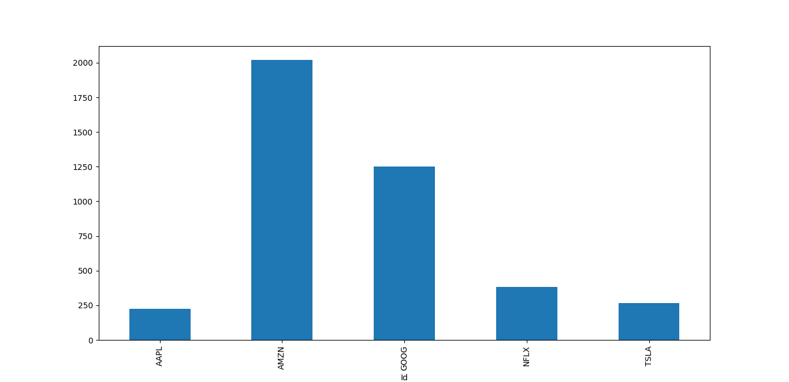

# Atividade de manipulação de bases de dados com Pandas

Este gráfico mostra a ação com maior média do período.

- São 5 datasets do último ano de 5 das maiores empresas de tecnologia do mundo Apple, Google, Netflix, Amazon e Tesla. 

- Sua tarefa é adicionar uma coluna com o código de cada ação,

- passar a data como dtype datatime e transformá-la em index, 

- Depois deve juntar todos os arquivos em um só, 

- Qual das 5 ações teve a maior média de fechamento no período de julho a setembro de 2019?

